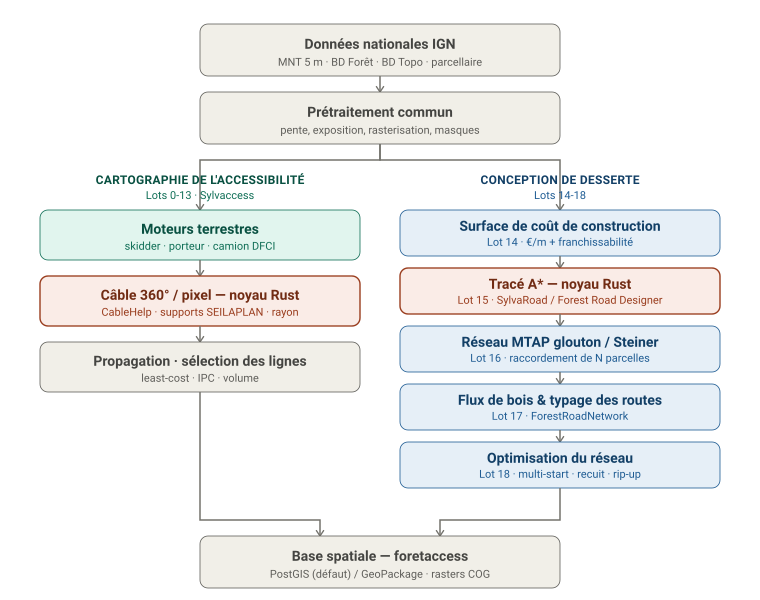

# ForêtAccess

<!-- badges: start -->
[](https://github.com/pobsteta/foretaccess/actions/workflows/R-CMD-check.yaml)
[](https://github.com/pobsteta/foretaccess/releases/latest)
[](https://pobsteta.github.io/foretaccess/)
[](https://codecov.io/gh/pobsteta/foretaccess)
[](https://lifecycle.r-lib.org/articles/stages.html#experimental)
[](https://www.gnu.org/licenses/gpl-3.0)
<!-- badges: end -->

Cartographie automatique de l'**accessibilité des forêts** selon le mode d'exploitation
(skidder, porteur, câble-mât, camion DFCI). Réimplémentation moderne, découplée et
testable du modèle **Sylvaccess** (INRAE — S. Dupire), sous forme de **package R** avec un
**noyau câble en Rust** (via `extendr`), et des sorties en **base spatiale**
(PostGIS / GeoPackage).

## Démarrage rapide

```r
library(foretaccess)

toy <- system.file("extdata", "toy", package = "foretaccess")
pre <- preprocess(
  mnt      = file.path(toy, "mnt.tif"),
  desserte = file.path(toy, "desserte.gpkg"),
  foret    = file.path(toy, "foret.gpkg")
)

sk  <- skidder(pre)          # débusqueur
po  <- porteur(pre)          # porteur
df  <- camion_dfci(pre)      # zone défendable DFCI (moteur radial)
cab <- potentiel_cable(pre)  # lignes de câble faisables (noyau Rust)
sel <- selectionner_lignes(cab)

sk$recap                     # surfaces (ha) par classe d'accessibilité
```

Le pipeline complet — prétraitement, moteurs, câble, **agrégation zonale**
(`agreger_zones()`) et **persistance** en base spatiale — est détaillé dans la
vignette :

```r
vignette("foretaccess")
```

## Architecture



Deux chaînes partant d'un prétraitement commun : la **cartographie de
l'accessibilité** (moteurs terrestres et câble, dérivés de Sylvaccess) et la
**conception de desserte** (surface de coût, tracé A\*, réseau, flux/typage,
optimisation). Détail des couches, périmètre et décisions : voir le **brief projet**
[`docs/foretaccess-brief.md`](docs/foretaccess-brief.md).

## Statut

Développement *spec-driven* / agile par lots (`specs/0XX-*.md` + ADR + tests de
non-régression). **Cartographie de l'accessibilité** (Lots 0-13) livrée et
**validée cellule à cellule contre Sylvaccess** sur le jeu ColduPre (skidder
99,95 %, porteur 99,72 %, câble 98,36 %, DFCI 99,87 %) — version majeure `v1.0.0`.
**Conception de desserte** (Lots 14-18 : coût, tracé A\* Rust, réseau, flux/typage,
optimisation) livrée en `v1.2.0`. Les feuilles de route vivent dans
[`docs/ROADMAP.md`](docs/ROADMAP.md) et [`docs/ROADMAP-desserte.md`](docs/ROADMAP-desserte.md).

## Stack

- **R** : orchestration, I/O SIG (`terra`, `sf`), prétraitement, plus court chemin
  (`leastcostpath`/`gdistance`), moteurs terrestres, pipeline (`targets`).
- **Rust** : noyau câble (mécanique CableHelp), exposé via **`extendr`/`rextendr`**,
  parallélisme **`rayon`**.
- **Stockage** : PostGIS (défaut, `DBI`/`RPostgres`) ou GeoPackage (`sf`) derrière une
  interface commune ; rasters en GeoTIFF/COG (`terra`).

Cohérent avec l'écosystème Nemeton (R/Shiny/golem, PostGIS) : utilitaires et base
spatiale potentiellement partagés.

## Licence & attribution

ForêtAccess est distribué sous **GPL v3**. C'est un **travail dérivé** de plusieurs
modèles libres, chacun sous GPL v3 ; merci de les citer selon la partie utilisée.

**Cartographie de l'accessibilité (moteurs terrestres & câble, Lots 0-13)** — dérivé de
**Sylvaccess** (INRAE, S. Dupire) :

- Dupire S., Bourrier F., Monnet J.-M., Berger F. (2015). *Sylvaccess : un modèle pour
  cartographier automatiquement l'accessibilité des forêts.* Revue Forestière Française.
- Dupire S., Bourrier F., Berger F. (2016). *Predicting load path and tensile forces
  during cable yarding operations on steep terrain.* Journal of Forest Research,
  DOI [10.1007/s10310-015-0503-4](https://doi.org/10.1007/s10310-015-0503-4).
- Sylvaccess : DOI [10.15454/JUBESS](https://doi.org/10.15454/JUBESS).

**Optimisation de la hauteur des supports câble (Lot 13)** — méthode **SEILAPLAN**
(graphe + Dijkstra de Bont & Heinimann), P. Moll et al.
([github.com/piMoll/SEILAPLAN](https://github.com/piMoll/SEILAPLAN), GPL v3) :

- Bont L., Heinimann H.R. (2012). *Optimum geometric layout of a single cable road.*
  European Journal of Forest Research.
- Bont L.G., Moll P.E., Ramstein L., Frutig F., Heinimann H.R., Schweier J. (2022).
  *SEILAPLAN, a QGIS Plugin for Cable Road Layout Design.* Croat. j. for. eng. 43(2).

**Conception de desserte — solveur de tracé (Lot 15)** — porté de **SylvaRoad**
(S. Dupire / SylvaLab / ONF, [gitlab.com/SDupire/sylvaroad](https://gitlab.com/SDupire/sylvaroad),
GPL v3) et de **Forest Road Designer** (PANOimagen / Gob. La Rioja, GPL v3).

**Conception de desserte — réseau, flux & typage (Lots 16-18)** — repris de
**ForestRoadNetwork** (Klemet, plugin QGIS, GPL v3).
