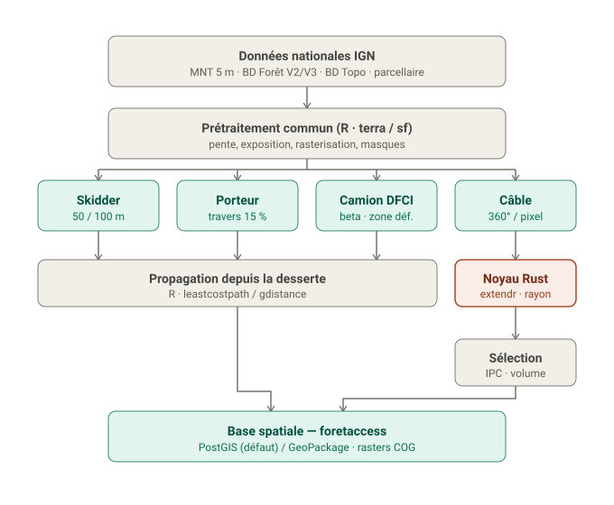

# ForêtAccess

<!-- badges: start -->

<!-- badges: end -->

Cartographie automatique de l'**accessibilité des forêts** selon le mode d'exploitation
(skidder, porteur, câble-mât, camion DFCI). Réimplémentation moderne, découplée et
testable du modèle **Sylvaccess** (INRAE — S. Dupire), sous forme de **package R** avec un
**noyau câble en Rust** (via `extendr`), et des sorties en **base spatiale**
(PostGIS / GeoPackage).

## Architecture cible

Détail des couches, périmètre et décisions : voir le **brief projet**
[`docs/foretaccess-brief.md`](docs/foretaccess-brief.md).

## Statut

Amorçage. Le développement suit un workflow *spec-driven* / agile par lots
(`specs/0XX-*.md` + ADR + tests de non-régression), piloté via Claude Code.
La feuille de route est décrite dans le brief (§10 Lotissement).

## Stack

- **R** : orchestration, I/O SIG (`terra`, `sf`), prétraitement, plus court chemin
  (`leastcostpath`/`gdistance`), moteurs terrestres, pipeline (`targets`).
- **Rust** : noyau câble (mécanique CableHelp), exposé via **`extendr`/`rextendr`**,
  parallélisme **`rayon`**.
- **Stockage** : PostGIS (défaut, `DBI`/`RPostgres`) ou GeoPackage (`sf`) derrière une
  interface commune ; rasters en GeoTIFF/COG (`terra`).

Cohérent avec l'écosystème Nemeton (R/Shiny/golem, PostGIS) : utilitaires et base
spatiale potentiellement partagés.

## Licence & attribution

Distribué sous **GPL v3** (travail dérivé de Sylvaccess, GPL v3). Merci de citer :

- Dupire S., Bourrier F., Monnet J.-M., Berger F. (2015). *Sylvaccess : un modèle pour
  cartographier automatiquement l'accessibilité des forêts.* Revue Forestière Française.
- Dupire S., Bourrier F., Berger F. (2015). *Predicting load path and tensile forces
  during cable yarding operations on steep terrain.* Journal of Forest Research,
  DOI [10.1007/s10310-015-0503-4](https://doi.org/10.1007/s10310-015-0503-4).
- Sylvaccess : DOI [10.15454/JUBESS](https://doi.org/10.15454/JUBESS).
