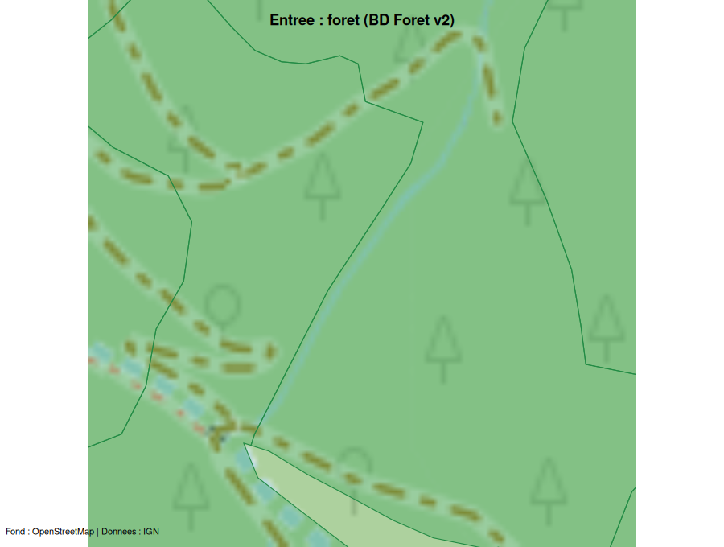
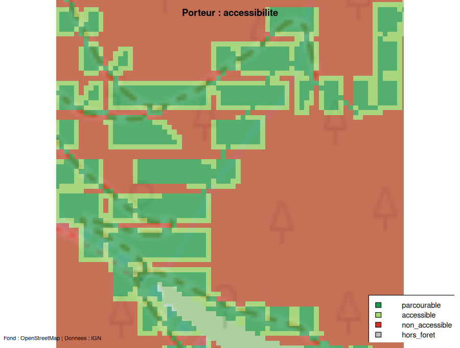

# Cartes de sortie sur une AOI réelle

Cette page illustre le pipeline complet sur une **AOI réelle** (un
massif des Cévennes, `data-raw/aoi.gpkg`) : les entrées sont
**acquises** depuis l’IGN (Lot 10), chaque moteur est exécuté, et
**chaque sortie est cartographiée sur un fond OpenStreetMap**.

Les cartes ci-dessous sont **pré-rendues** par le script
`data-raw/cartes.R` (acquisition IGN réelle + tuiles OSM via `maptiles`)
: elles sont embarquées comme images, de sorte que la construction du
site ne relance ni calcul lourd ni requête réseau. Le rendu porte sur
une **fenêtre de 350 m** au centre de l’AOI — assez petite pour que le
**balayage câble** y termine en ~1 min (voir la note de performance en
fin de page).

Le code de bout en bout — acquisition, moteurs, cartographie — est
celui-ci :

``` r

library(foretaccess)
library(maptiles)

aoi <- sf::st_read("aoi.gpkg")                       # emprise (EPSG:2154)
inp <- acquire_inputs(aoi, sources = c("mnt", "desserte", "foret"))
pre <- preprocess(inp$mnt, inp$desserte, inp$foret)

sk  <- skidder(pre)
po  <- porteur(pre)
df  <- camion_dfci(pre, foretaccess_config(
         dfci = list(classes_source = c("route", "piste"))))  # cf. note DFCI
cab <- potentiel_cable(pre)
sel <- selectionner_lignes(cab)

# Fond OSM commun, puis superposition de chaque sortie (voir data-raw/cartes.R).
bm <- get_tiles(aoi, provider = "OpenStreetMap", crop = TRUE)
```

## Entrées acquises

Les trois couches téléchargées depuis l’IGN Géoplateforme, sur fond OSM.


MNT RGE ALTI 5 m


Desserte BD TOPO (classée route / piste)



Forêt BD Forêt v2

## Sorties raster

Accessibilité par mode d’exploitation. Les cellules **hors forêt** sont
laissées transparentes (le fond OSM apparaît).


Skidder (débusqueur) : accessibilité



Porteur (forwarder) : accessibilité


Camion DFCI : zone défendable

## Sorties vecteur


Câble : lignes sélectionnées (sur la desserte)


Agrégation zonale : surface parcourable (ha) par quadrant

## Note DFCI

BD TOPO ne distingue pas la classe **DFCI** de la desserte (spec 010,
décision Q2). Pour cette démonstration, les pistes et routes forestières
servent de base au camion (`classes_source = c("route", "piste")`) — ce
qui est réaliste en forêt.

## Note de performance

Durées mesurées sur l’**AOI complète** (721 ha, 340 090 cellules à 5 m
dont 248 658 en forêt), un cœur :

| Étage                                    | Durée (721 ha)         |
|------------------------------------------|------------------------|
| Acquisition IGN (MNT + desserte + forêt) | ~10 s                  |
| Prétraitement                            | ~1 s                   |
| Skidder                                  | ~34 s                  |
| Porteur                                  | ~37 s                  |
| Camion DFCI                              | ~13 s                  |
| Agrégation zonale                        | \<1 s                  |
| **Sous-total hors câble**                | **~1 min 35 s**        |
| **Câble (potentiel 360°/pixel)**         | **heures à \> 1 jour** |

Les moteurs terrestres traitent un massif de 721 ha en ~1,5 min. Le
**câble**, lui, est le goulot : chaque rayon monte jusqu’à
`longueur_max` (750 m), et le coût par cellule explose avec l’étendue
(une fenêtre de 500 m a dépassé 48 min CPU sans terminer). À l’échelle
de l’AOI, il est **impraticable en l’état** — d’où la dette assumée
(portage Rust du noyau, tuilage, plafonnement de portée). C’est pourquoi
la carte câble ci-dessus est calculée sur une petite fenêtre.

## Attribution

Fond de carte © contributeurs **OpenStreetMap**. Données © **IGN**
(Géoplateforme). ForêtAccess est distribué sous **GPL v3** (dérivé de
Sylvaccess, INRAE).
