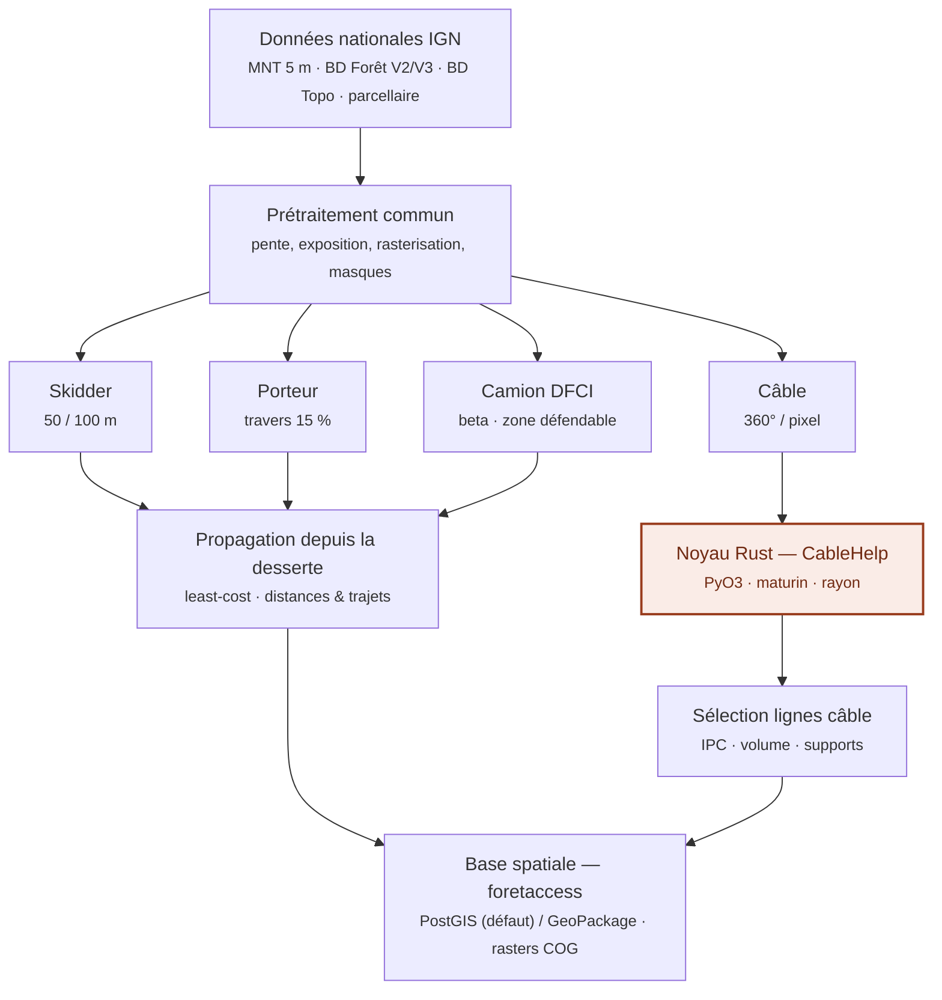

# ForêtAccess — Brief projet

> Document d'amorçage destiné à **Claude Code**, dans un workflow *spec-driven* / agile
> par lots (mêmes conventions que le projet Nemeton : `specs/0XX-*.md`, ADR, lots =
> sprints, critères d'acceptation, Definition of Done).
>
> **Statut** : brief initial, à transformer en specs + backlog + roadmap.
> **Dépôt cible** : `github.com/pobsteta/foretaccess`
> **Licence** : GPL v3 (dérivé de Sylvaccess © S. Dupire / INRAE — voir §1).

---

## 0. Mission Claude Code (comment utiliser ce brief)

À partir de ce brief, tu dois produire, **avant tout code** :

1. Un **PRD léger** (`docs/PRD.md`) : objectifs, périmètre MVP, exigences fonctionnelles
   et non-fonctionnelles, hors-périmètre.
2. Un **backlog** structuré en **epics → user stories → critères d'acceptation**,
   dérivé du périmètre fonctionnel (§4) et du lotissement (§10).
3. Une **roadmap par lots** (`docs/ROADMAP.md`) reprenant le lotissement §10, chaque
   lot devenant un fichier `specs/0XX-<nom>.md`.
4. Les **ADR** listés en §5 (`docs/adr/ADR-00X-*.md`), une décision par fichier.
5. Le **scaffolding** du dépôt (§11) une fois les specs du Lot 0 validées.

Règles de travail (spec-driven) :

- **Une spec avant un lot.** Ne pas coder un lot tant que sa `specs/0XX` n'est pas
  rédigée et validée. Chaque spec contient : contexte, périmètre, entrées/sorties,
  algorithme, critères d'acceptation, tests, risques.
- **Tests d'abord** pour tout ce qui reproduit Sylvaccess : mettre en place le harnais
  de **non-régression** (§7) au Lot 0, puis chaque moteur est validé contre les sorties
  de Sylvaccess v3.6 avant d'être considéré « fait ».
- **Trancher les questions ouvertes (§9) avec l'utilisateur** avant de lancer le lot
  concerné ; ne pas décider seul sur ces points.
- **Petits incréments livrables.** Chaque lot se termine par : code + tests verts +
  doc + entrée `CHANGELOG` + éventuel ADR. Respecter la Definition of Done (§12).
- Proposer les commandes `git` (branche par lot, commits atomiques, PR par lot).

---

## 1. Contexte & vision

**ForêtAccess** est une réimplémentation moderne du modèle **Sylvaccess** (INRAE –
Sylvain Dupire, v3.6 2025, GPL v3, DOI `10.15454/JUBESS`), qui cartographie
automatiquement l'accessibilité des forêts selon le mode d'exploitation.

Le code Sylvaccess actuel (Python 3 + Cython, hérité de Python 2.7) est **monolithique
et couplé à une UI PyQt** : logique métier lue directement depuis l'interface, ~80
variables globales, 59 `except:` nus, I/O raster « à la main ». Cela empêche l'usage en
CLI/batch, la réutilisation (plugin QGIS) et les tests automatisés.

**Vision ForêtAccess** : un **cœur métier pur, découplé de toute UI**, testable,
performant, réutilisable (CLI, batch, plugin QGIS, service), avec **sorties dans une
base spatiale** (PostGIS / GeoPackage) exploitable directement dans l'écosystème SIG.

**Filiation & licence** : ForêtAccess est un travail dérivé de Sylvaccess (GPL v3) et
reste sous **GPL v3**. Toute diffusion doit citer :
- Dupire S., Bourrier F., Monnet J.-M., Berger F. (2015). *Sylvaccess : un modèle pour
  cartographier automatiquement l'accessibilité des forêts.* Revue Forestière Française.
- Dupire S., Bourrier F., Berger F. (2015). *Predicting load path and tensile forces
  during cable yarding operations on steep terrain.* J. of Forest Research,
  DOI `10.1007/s10310-015-0503-4`.

---

## 2. Objectif du développement

Cartographier l'accessibilité pour **4 modes d'exploitation** :

| Moteur | But | Statut cible |
|---|---|---|
| **Skidder** (tracteur/débusqueur) | distances de débardage, zones inaccessibles | MVP |
| **Porteur** | idem (sans distance de treuillage) | MVP |
| **Câble** (câble-mât) | potentiel câble d'un massif, aide à la planification | MVP |
| **Camion DFCI** | zone défendable depuis les dessertes (défense incendie) | **beta** |

Choix structurants :
- **Cœur métier pur** (fonctions prenant config + tableaux, sans dépendance UI).
- **Orchestration Python** ; **noyau câble en Rust** (le point chaud, ~60 M lignes,
  ~1 ms/ligne dans l'implémentation actuelle).
- **Entrées** : données nationales IGN (MNT 5 m, BD Forêt V2/V3, BD Topo).
- **Sorties** : **PostGIS (défaut) / GeoPackage** pour les vecteurs, **GeoTIFF/COG** pour
  les rasters, derrière une interface de stockage commune.
- **Échelle** : du massif au national, via **tuilage** et parallélisme.

---

## 3. Architecture cible

Schéma complet (vectoriel, versionnable) : [`man/figures/architecture.svg`](../man/figures/architecture.svg).

Version Mermaid (rendue sur GitHub) :



Lecture par couches :
1. **Données** : couches IGN homogènes au niveau national (parcellaire = évolution future,
   cf. projet DESSOPT).
2. **Prétraitement commun** : pente/exposition depuis le MNT, rasterisation des vecteurs à
   la résolution du MNT, masques d'obstacles, exclusion des pentes > seuil d'abattage.
3. **Moteurs** : 4 modules. Skidder/Porteur/DFCI partagent un **service de propagation
   depuis la desserte** (coût-distance / least-cost). Le **Câble** appelle le **noyau
   Rust** puis la **sélection multicritère** des lignes.
4. **Sorties** : écriture dans la base spatiale (vecteurs) + rasters COG.

---

## 4. Périmètre fonctionnel (→ epics)

### 4.1 Prétraitement (commun)
- Entrées : MNT (raster), desserte (polylignes classées : route forestière / piste / DFCI),
  forêt (polygones), obstacles complets (vecteur), obstacles partiels (skidder), volume sur
  pied (raster, optionnel).
- Traitements : validation des entrées (CRS commun, alignement grille sur MNT, champs
  attributaires requis), pente %, exposition, rasterisation, masques d'obstacles, exclusion
  pente > 100 % (abattage manuel impossible).
- Sortie : jeu de rasters intermédiaires alignés + masques.

### 4.2 Skidder
- Règle : pente ≤ 30 % → circulation libre du skidder ; pente > 30 % → treuillage depuis
  desserte (50 m amont / 100 m aval par défaut) avec bascule vers distance max au-delà de
  certaines pentes (voir §6).
- Sorties (rasters) : zone accessible, zone parcourable par l'engin, non accessible, distance
  de treuillage, distances de traînage (piste + forêt), distance totale de débardage, trajet
  optimal vers place de dépôt. + tableau récapitulatif surfaces/volumes par classe.

### 4.3 Porteur
- Règle : pente en travers ≤ 15 % → circulation libre ; sinon portage en ligne droite dans
  un cône d'azimuts respectant la pente en travers max, avec pentes en long ≤ 30 % (montée)
  / ≤ 25 % (descente), portée ≤ 300 m. Portée de grue 8 m.
- Sorties : idem skidder **sans** distance de treuillage.

### 4.4 Câble (+ sélection)
- Pour chaque pixel de route : 360 lignes (pas 1°) de longueur ≤ longueur max du câble.
  Test de faisabilité : hauteur du câble porteur ∈ [4 m, 30 m] et tension ≤ rupture / coeff.
  sécurité (modèle mécanique **CableHelp** : caténaire élastique + frottement aux supports).
  Optimisation du nombre/placement des supports intermédiaires (0…N), raccourcissement,
  longueur ≥ min.
- Sorties : **base des lignes techniquement faisables** (table géométrique), raster des zones
  accessibles, tableau récapitulatif.
- **Sélection multicritère** : max surface, min supports, sens (amont/aval), longueur, max
  volume, max IPC (= volume / longueur).

### 4.5 Camion DFCI (beta)
- Cartographie de la **zone défendable** depuis les dessertes DFCI identifiées.
- À stabiliser (cf. projet QUALIROAD). Peut être un lot ultérieur au MVP (cf. §9).

---

## 5. Décisions techniques (→ ADR, un fichier par décision)

| ADR | Décision | Résumé |
|---|---|---|
| ADR-001 | **Langages** | Orchestration & moteurs terrestres en **Python** ; **noyau câble en Rust** exposé via **PyO3 + maturin**, parallélisme **rayon**. Libs Python : `numpy`, `rasterio`, `scikit-image` (least-cost `MCP`), `geopandas`/`pyogrio`, `pyproj`. |
| ADR-002 | **Stockage** | Interface `StorageBackend` unique ; deux implémentations : **PostGIS** (défaut, via GeoAlchemy2/psycopg) et **GeoPackage** (via pyogrio). Rasters en **GeoTIFF/COG** sur disque (pas en base). |
| ADR-003 | **Configuration** | `pydantic` ; **valeurs par défaut = Sylvaccess v3.6** (§6), pas celles de l'article 2015. |
| ADR-004 | **Découplage** | Cœur pur sans UI ; I/O et orchestration en couches séparées ; pas de variables globales. |
| ADR-005 | **Passage à l'échelle** | Tuilage du territoire + parallélisme (`joblib`/`dask`) ; élagage spatial (ne traiter que forêt d'intérêt / voisinage desserte). |
| ADR-006 | **Validation** | Tests de **non-régression** contre Sylvaccess v3.6 comme oracle (§7). |
| ADR-007 | **Packaging & CI** | `pyproject.toml` + `Cargo.toml` (maturin) ; deps épinglées ; CI (lint `ruff`, `mypy`, `pytest`, `cargo test`, build wheels). |

---

## 6. Paramètres métier de référence (Sylvaccess v3.6)

> Ces défauts (RdV Experts 2026, v3.6) **diffèrent de l'article de 2015** ; ce sont
> ceux à encoder dans la config (ADR-003). Deltas notables signalés.

**Skidder**
- Distance max débusquage amont de la desserte : **50 m**
- Distance max débusquage aval de la desserte : **100 m** *(article : 150 m)*
- Pente au-delà de laquelle débusquage amont = distance max : **75 %**
- Pente au-delà de laquelle débusquage aval = distance max : **20 %**
- Distance max parcourable hors forêt et hors desserte : **50 m** *(nouveau)*
- Pente max pour parcourir le terrain en skidder : **30 %** *(article : 25 %)*
- Pente max pour l'abattage manuel : **100 %** *(article : 110 %)*

**Porteur**
- Pente en travers max : **15 %**
- Pente max en remontant les bois : **30 %**
- Pente max en descendant les bois : **25 %**
- Portée de la grue : **8 m** *(nouveau)*
- Distance max quand pente > pente en travers max : **300 m**
- Distance max parcourable hors forêt et hors desserte : **200 m** *(nouveau)*
- Pente max pour l'abattage manuel : **100 %**

**Câble (défauts par type de matériel)** — hauteur mât, longueur/diamètre/masse
linéaire/tension de rupture du câble porteur, nombre max de supports, hauteur câble ∈
[4 m, 30 m], coeff. de sécurité. Reprendre les tableaux 1 & 2 de l'article + config v3.6.

---

## 7. Spécifié vs à récupérer

**Entièrement spécifié** (article + deck + ce brief) : entrées, prétraitement, règles
skidder/porteur, procédure câble (360°/pixel, seuils hauteur/tension, échelle des supports,
raccourcissement), critères de sélection, paramètres par défaut v3.6.

**À récupérer depuis le code source Sylvaccess** (GPL v3, dispo sur `forge.inrae.fr` ;
module Cython `sylvaccess_cython3.pyx`) — car l'article ne donne que les erreurs de
validation :
- **Équations mécaniques CableHelp** : caténaire élastique (`asinh`), tension vs position
  du chariot, frottement aux supports (`frottement`, `mainline`), optimisation des pylônes
  (`OptPyl_Up/Down`, variantes hauteur variable). Cf. aussi Dupire et al. 2015 (JFR).
- **Fonction de coût** des plus courts chemins (`calcul_distance_de_cout`) pour skidder/porteur.
- **« Unités de vidange optimales »** et le pas de recherche supports / raccourcissement.

**Oracle de non-régression** : générer, avec Sylvaccess v3.6, les sorties sur un petit jeu
de données jouet (MNT synthétique + desserte + forêt) et sur quelques profils câble ; les
figer comme références. Cibles : erreur ≤ 0,1 % sur la trajectoire de charge et ≤ 1,5 % sur
la tension (valeurs de validation publiées).

---

## 8. Exigences non-fonctionnelles

- **Performance** : moteurs terrestres rapides (référence v3.6 : PNR Morvan 3290 km² →
  ~18 min skidder / ~1h23 porteur au 5 m) ; câble = point chaud → noyau Rust + parallélisme
  (objectif : diviser fortement les temps actuels ; le câble ~800 ha/20 km ≈ 20 min).
- **Reproductibilité** : environnement épinglé (Python + Rust), build maturin, données
  d'exemple versionnées, seeds si aléatoire.
- **Qualité** : `ruff` + `mypy` + `pytest` (Python), `clippy` + `cargo test` (Rust) ;
  couverture minimale sur le cœur.
- **Observabilité** : `logging` (niveaux) au lieu de `print`, journal d'erreurs structuré.
- **i18n** : messages FR/EN externalisés (dictionnaire/`gettext`), pas de `if language==...`
  disséminés.
- **Robustesse I/O** : context managers systématiques, `pathlib`, `makedirs(exist_ok=True)`,
  exceptions ciblées (zéro `except:` nu).

---

## 9. Questions ouvertes (à trancher avec l'utilisateur avant lancement)

1. **Backend par défaut** : PostGIS (proposé, cohérent avec l'écosystème Nemeton) ou
   GeoPackage ?
2. **DFCI beta** dans le **MVP** ou lot post-MVP ?
3. **Least-cost** : rester en Python (`scikit-image`) ou porter aussi en Rust à terme ?
4. **Récupération du `.pyx`** comme oracle et base de portage (GPL v3 → compatible) : OK ?
5. **Parcellaire (DESSOPT)** : hors périmètre v1 (simple couche d'entrée future) ?
6. **Schéma PostGIS** : base dédiée `foretaccess` avec schéma par run/massif, ou table
   unique + colonne `run_id` ?

---

## 10. Lotissement (roadmap agile — chaque lot → `specs/0XX` + ADR + tests)

| Lot | Nom | Livrables | Critères d'acceptation |
|---|---|---|---|
| **0** | Fondations | Repo, `pyproject`/`Cargo`, config `pydantic` (défauts v3.6), interface `StorageBackend` (postgis+gpkg), CI, **jeu de données jouet** + harnais de non-régression, squelette Rust (maturin build OK). ADR-001/002/003/004/007. | `pip install -e .` + `maturin develop` OK ; CI verte ; écriture/lecture d'une couche test en PostGIS **et** GPKG ; `pytest` de base passe. |
| **1** | I/O & prétraitement | Lecture IGN (raster/vecteur), validation entrées, alignement grille, pente/exposition, rasterisation, masques, exclusion pente. `specs/001`. | Sur le jeu jouet : rasters pente/expo et masques conformes à l'oracle (tolérance définie) ; erreurs d'entrée explicites. |
| **2** | Moteur Skidder | Règles v3.6 + service least-cost + sorties rasters/tableau. `specs/002`. Non-régression. | Distances (treuillage, traînage, totale) et zones vs Sylvaccess v3.6 sous tolérance ; tableau récap correct. |
| **3** | Moteur Porteur | Cône d'azimuts, pentes long/travers, portée. `specs/003`. Non-régression. | Sorties conformes à v3.6 (hors treuillage). |
| **4** | Noyau Câble (Rust) | Crate `cablehelp` (CableHelp + faisabilité + optimisation supports) via PyO3 ; balayage 360°/pixel parallèle. `specs/004`, ADR-005. Non-régression profils. | Sur N profils de référence : trajectoire ≤ 0,1 %, tension ≤ 1,5 % ; base des lignes faisables produite ; speedup mesuré vs mono-thread. |
| **5** | Sélection lignes câble | Sélection multicritère (surface, supports, sens, longueur, volume, IPC). `specs/005`. | Sélection reproductible vs v3.6 sur jeu test ; requêtable en base. |
| **6** | Camion DFCI (beta) | Zone défendable depuis desserte DFCI. `specs/006`. | Sortie beta documentée + testée sur zone échantillon (selon décision §9.2). |
| **7** | Passage à l'échelle | Tuilage + parallélisme + sorties COG. `specs/007`, ADR-005. | Traitement d'un massif complet en tuiles, résultat identique au traitement mono-bloc (raccords corrects). |
| **8** | Base spatiale & agrégation | Schéma PostGIS (DDL), export GPKG, agrégation zonale SQL (massif/parcelle/commune). `specs/008`, ADR-002. | Écriture idempotente ; index spatiaux ; requêtes d'agrégation validées. |
| **9** | Doc & publication | README, doc d'usage (CLI), exemples, `CHANGELOG`, packaging/wheels. | Doc à jour ; exemple reproductible de bout en bout ; version taguée. |

---

## 11. Structure du dépôt proposée

```
foretaccess/
├─ README.md
├─ LICENSE                      # GPL v3
├─ pyproject.toml               # packaging Python (maturin backend)
├─ Cargo.toml                   # workspace Rust
├─ docs/
│  ├─ foretaccess-brief.md      # ce document
│  ├─ PRD.md                    # (à générer)
│  ├─ ROADMAP.md                # (à générer)
│  └─ adr/                      # ADR-001…007
├─ specs/                       # 000-fondations.md, 001-pretraitement.md, …
├─ src/foretaccess/
│  ├─ config.py                 # pydantic, défauts v3.6
│  ├─ io/                       # readers IGN, StorageBackend (postgis, gpkg), raster COG
│  ├─ preprocessing/            # pente, expo, rasterisation, masques
│  ├─ routing/                  # service least-cost partagé
│  ├─ engines/                  # skidder.py, porteur.py, dfci.py, cable.py
│  ├─ selection/                # sélection multicritère des lignes câble
│  ├─ pipeline/                 # tuilage, orchestration, parallélisme
│  └─ cli.py
├─ crates/
│  └─ cablehelp/                # crate Rust (PyO3) : mécanique + balayage câble
├─ tests/
│  ├─ data/                     # jeu jouet + oracles Sylvaccess v3.6
│  ├─ nonreg/                   # tests de non-régression
│  └─ unit/
└─ .github/workflows/ci.yml
```

---

## 12. Definition of Done (par lot)

- [ ] Spec `specs/0XX` rédigée et validée ; ADR associé si décision structurante.
- [ ] Code + tests unitaires ; **non-régression verte** pour tout ce qui reproduit v3.6.
- [ ] `ruff`/`mypy`/`pytest` et `clippy`/`cargo test` OK en CI.
- [ ] Zéro `except:` nu ; I/O en context managers ; logging (pas de `print`).
- [ ] Doc d'usage à jour + entrée `CHANGELOG`.
- [ ] Branche dédiée + PR + revue ; commits atomiques.

---

## 13. Références

- Sylvaccess v3.6 (INRAE, S. Dupire) — GPL v3, DOI `10.15454/JUBESS`,
  dépôt `forge.inrae.fr/sylvain.dupire/sylvaccess`.
- Dupire et al. 2015, *Revue Forestière Française* n°2015-2.
- Dupire et al. 2015, *J. of Forest Research*, DOI `10.1007/s10310-015-0503-4`.
- RdV Experts « De nouvelles cartes sur l'accessibilité des forêts » (IGN/INRAE/ADEME,
  19 mai 2026) — données nationales, module DFCI, projets DESSOPT & QUALIROAD.
- PyO3 / maturin (bindings Rust↔Python), `rasterio`, `scikit-image` (least-cost `MCP`),
  `geopandas`/`pyogrio`, PostGIS.
```
