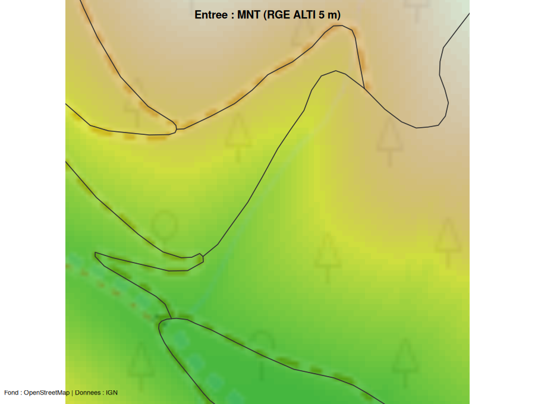
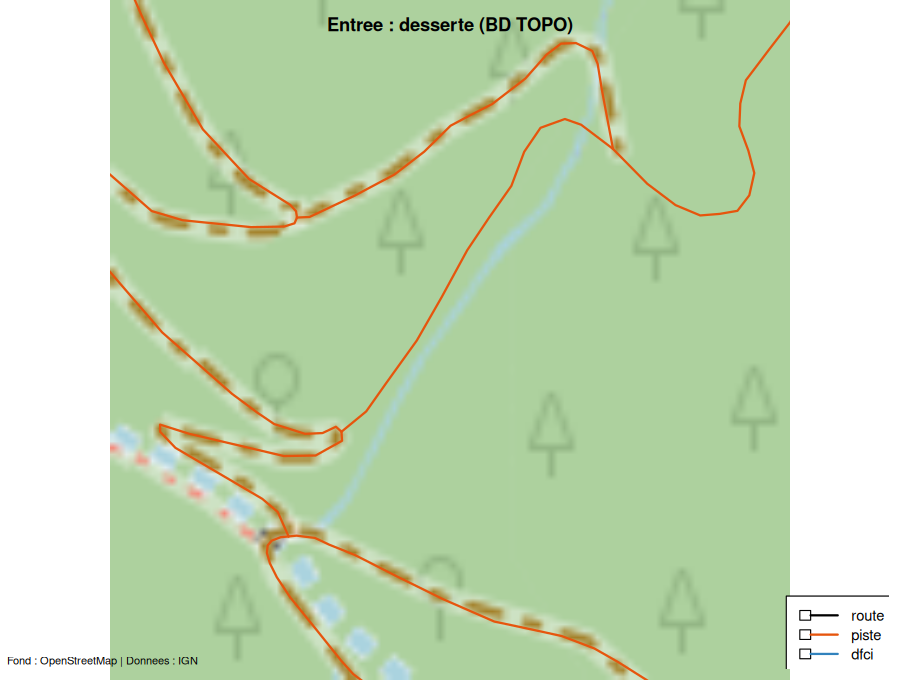
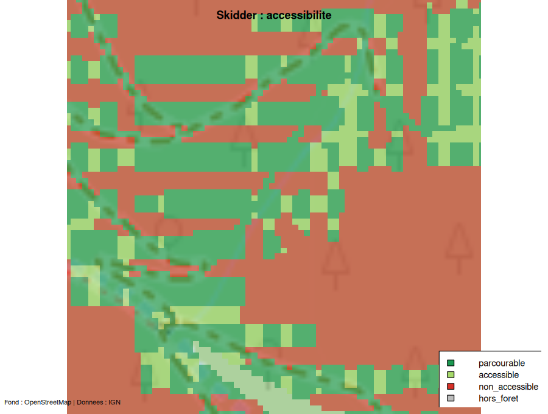
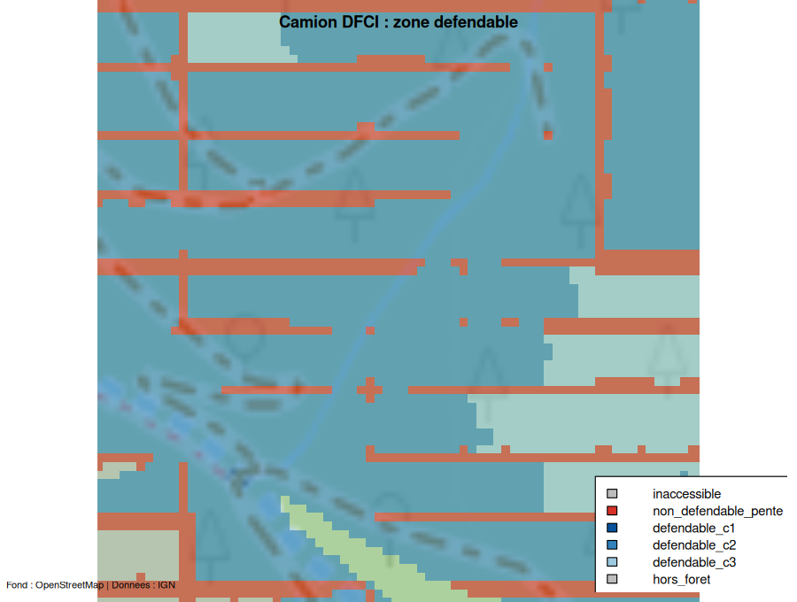
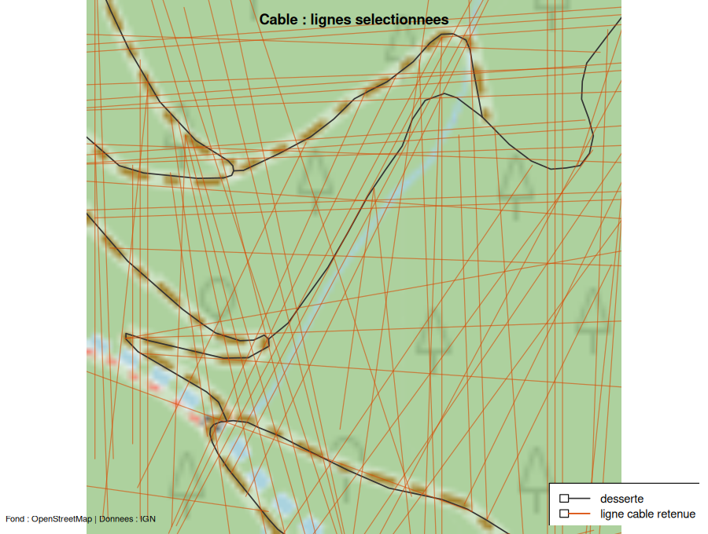
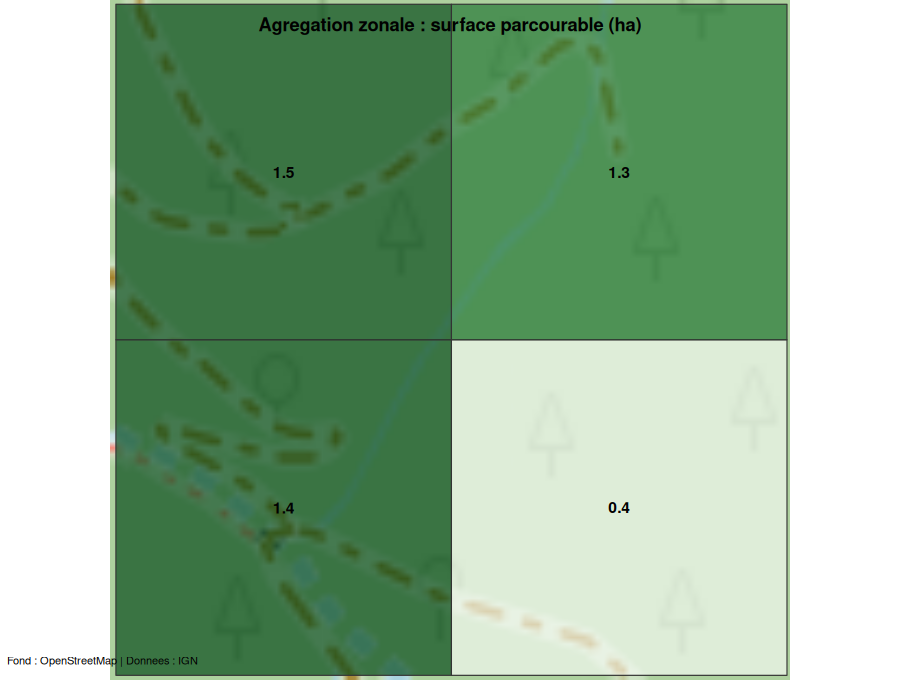

```{r, include = FALSE}
knitr::opts_chunk$set(collapse = TRUE, comment = "#>", echo = FALSE, out.width = "100%")
```

Cette page illustre le pipeline complet sur une **AOI réelle** (un massif des
Cévennes, `data-raw/aoi.gpkg`) : les entrées sont **acquises** depuis l'IGN
(Lot 10), chaque moteur est exécuté, et **chaque sortie est cartographiée sur un
fond OpenStreetMap**.

Les cartes ci-dessous sont **pré-rendues** par le script `data-raw/cartes.R`
(acquisition IGN réelle + tuiles OSM via `maptiles`) : elles sont embarquées comme
images, de sorte que la construction du site ne relance ni calcul lourd ni requête
réseau. Le rendu porte sur une **fenêtre de 350 m** au centre de l'AOI — assez
petite pour que le **balayage câble** y termine en ~1 min (voir la note de
performance en fin de page).

Le code de bout en bout — acquisition, moteurs, cartographie — est celui-ci :

```{r code, echo = TRUE, eval = FALSE}
library(foretaccess)
library(maptiles)

aoi <- sf::st_read("aoi.gpkg")                       # emprise (EPSG:2154)
inp <- acquire_inputs(aoi, sources = c("mnt", "desserte", "foret"))
inp$desserte$dfci <- as.integer(inp$desserte$classe %in% c("route", "piste"))  # cf. note DFCI
pre <- preprocess(inp$mnt, inp$desserte, inp$foret)

sk  <- skidder(pre)
po  <- porteur(pre)
df  <- camion_dfci(pre)
cab <- potentiel_cable(pre)
sel <- selectionner_lignes(cab)

# Fond OSM commun, puis superposition de chaque sortie (voir data-raw/cartes.R).
bm <- get_tiles(aoi, provider = "OpenStreetMap", crop = TRUE)
```

## Entrées acquises

Les trois couches téléchargées depuis l'IGN Géoplateforme, sur fond OSM.






## Sorties raster

Accessibilité par mode d'exploitation. Les cellules **hors forêt** sont laissées
transparentes (le fond OSM apparaît).






## Sorties vecteur





## Note DFCI

BD TOPO ne distingue pas la classe **DFCI** de la desserte (spec 010, décision
Q2). Le camion lit le flag `dfci` de la desserte (attribut `CL_DFCI` chez
Sylvaccess) ; ici on marque les pistes et routes forestières comme sources
(`inp$desserte$dfci <- ...`) — réaliste en forêt. Le moteur radial classe alors
chaque cellule forestière en **bandes de défendabilité** (`defendable_c1/c2/c3`,
de la plus proche à la plus éloignée) ou en non-défendable.

## Note de performance

Durées des moteurs terrestres sur l'**AOI complète** (721 ha, 340 090 cellules à
5 m dont 248 658 en forêt), un cœur :

| Étage | Durée (721 ha) |
|---|---|
| Acquisition IGN (MNT + desserte + forêt) | ~10 s |
| Prétraitement | ~1 s |
| Skidder | ~34 s |
| Porteur | ~37 s |
| Camion DFCI | ~13 s |
| Agrégation zonale | <1 s |

Le **câble** a depuis été porté en **Rust parallélisé** (`rayon`) : sur le jeu de
référence ColduPre (923 k cellules, 3 supports intermédiaires), le balayage
360°/pixel tourne en **~40 s** — voir la note dédiée
[`docs/performance-coldupre.md`](https://github.com/pobsteta/foretaccess/blob/main/docs/performance-coldupre.md).
La carte câble ci-dessus reste calculée sur une petite fenêtre uniquement pour
garder la construction du site légère (acquisition IGN + tuiles OSM réelles), non
par contrainte de calcul.

## Attribution

Fond de carte © contributeurs **OpenStreetMap**. Données © **IGN** (Géoplateforme).
ForêtAccess est distribué sous **GPL v3** (dérivé de Sylvaccess et d'autres modèles
libres, cf. la section attribution du `README`).
